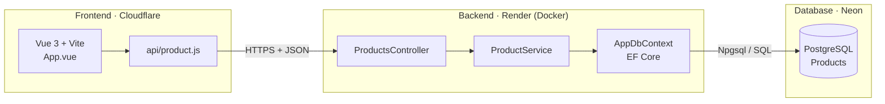

# Inventory System

## The main structure

```mermaid
flowchart LR
    subgraph FE["Frontend · Cloudflare"]
        A["Vue 3 + Vite<br/>App.vue"] --> B["api/product.js"]
    end
    subgraph BE["Backend · Render (Docker)"]
        C["ProductsController"] --> D["ProductService"] --> E["AppDbContext<br/>EF Core"]
    end
    subgraph DB["Database · Neon"]
        F[("PostgreSQL<br/>Products")]
    end
    B -- "HTTPS + JSON" --> C
    E -- "Npgsql / SQL" --> F
```
